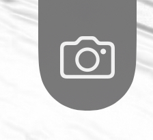
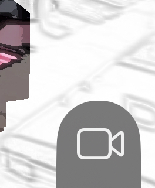

# Reality Filters

[Reality Filters][app] is a novel augmented reality app for iPhone and iPad that lets you paint image filters onto the real world. Turn the world into a giant coloring book or selectively adjust the colors of your couch.

This documentation covers the basics of using Reality Filters. If you run into any issues or have any feature requests, you can also [file an issue][issues] here.

## Drawing

Reality Filters works best on devices that have a LiDAR sensor, such as the iPhone 12 Pro or iPad Pro. However the app runs on all devices.

For devices with a LiDAR sensor, you can start drawing immediately after you launch the app. Touch on the screen to apply the current filter to that part of the world.

Note that you can only draw on surfaces that are under five meters away. The app also works best on solid surfaces. You generally cannot draw on water or glass.

Devices without a LiDAR sensor are limited to drawing on flat horizontal or vertical surfaces. After launching the app, you will see a preview of detected drawing surfaces. Try moving your device about the have it detect additional surfaces. Surface detection works best with good lighting on matte surfaces with some texture.

After confirming that the desired drawing surface is detected, press the checkmark to begin drawing.

## Effects
Reality Filters includes a number of build-in effects to select from. You can change the current effect by tapping on the sparkles icon and then tapping on the desired effect. 

Here's a list of the current filters:

- `Sketchy` — Renders the painted part of the world like it was sketched in pencil.

- `Coloring book` — Makes the world look like a pencil drawing. Paint on the world to fill in colors.

- `Monochrome` — Renders the painted part of the world grayscale.

- `Sepia` — Renders the painted part of the world in sepia.

- `Pleasantville` — Removes all color from the world. You can paint color back in.

- `Not Kansas` — Makes the world sepia toned. You can paint technicolor color back in.

- `Miami` — Renders the painted part of the world in teal and magenta.

- `Thermal` — Renders the painted part of the world teal and magenta.

- `Insta` — Renders the painted part of the world with a vintage style look.

- `Hue shift` — Adjust the color of the painted part of the world.

## Advanced Settings

### Body Effects

Users with an iPhone XR/XS or newer can configure how detected people in the scene are displayed. Possible settings:

- `ignore` — Don't apply any special treatment to detected people.

- `exclude` — Exclude detected people from all effects.

- `FG` — Treat detected people as part of the foreground (the painted bits of the world). With the `Coloring book` filter for example, people would be rendered using the colored-in effect.

- `BG` — Treat detected people as part of the background (the unpainted bits of the world). With the `Coloring book` filter for example, people would rendered using the pencil sketch effect. 

### Foreground Occlusion

(Note that foreground occlusion requires a device with a LiDAR sensor, such as the iPhone 12 Pro)

Foreground occlusion uses depth data from the LiDAR sensor to avoid applying the effects to painted parts of the scene that appear behind objects in the foreground. This foreground object could be a person, your hand, or a wall. The result makes it look like the effects are better integrated into the real world instead of merely being on your screen.

To enable foreground occlusion, tap the lightbulb icon and toggle "Foreground Occlusion". Keep in mind that the effect is not perfect and may cause artifacts, especially for complex scenes.

## Sharing

Tap the camera button on the right side to capture a screenshot of the current scene. This screenshot hides all UI elements so that you only see scene.

Tap the video button to start recording a video. This will show a prompt asking if you'd also like to record your microphone input. Tap the video button again to stop recording.

After taking a video or screenshot, you can download it to your photos or share it using the standard iOS share sheet. You can also trim videos right in the app.

## Feedback

Love Reality Filters? Be sure to tell your friends about it and share any cool content you create using the app. If you are feeling especially generous, please also write an App Store review. This really helps other people find the app.

Run into a bug or want to request a new feature? Just [file an issue][issues]!

[app]: https://apps.apple.com/us/app/reality-filters/id1582341494
[issues]: https://github.com/mattbierner/reality-filters-support/issues
